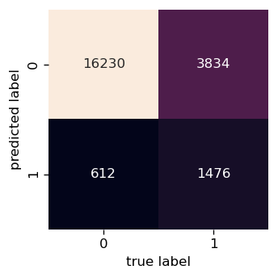
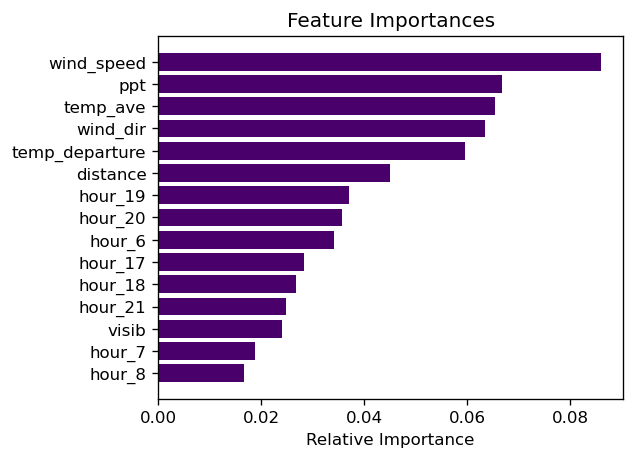
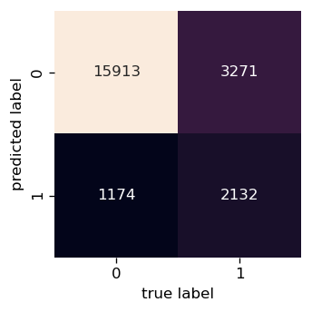
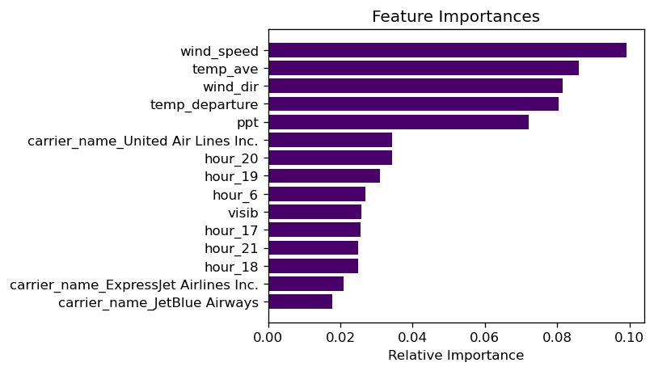
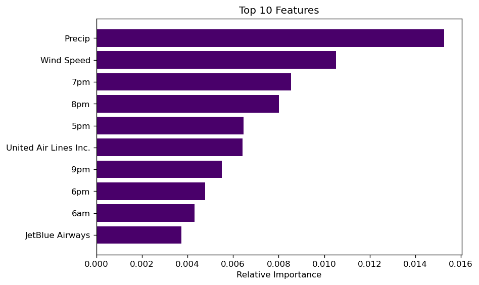

This is my final end to end data project for CodeClan. Written in Python in Jupyter Notebooks. The aim was to provide data-driven exploratory analysis to provide insight on the impact of weather on flight delays. To achieve this I did an exploratory data analysis and modelling. This entry contains the modelling.

# Random Forest Modeling

This model was selected for the following reasons:
* several groups have used this model to successfully model flight delays [example](https://ieeexplore.ieee.org/abstract/document/9256474)
* it is relatively easy to interpret
* the relative feature importance can be used to determine features important for delays

A Random Forest Classifier was used as I classified flights as delayed (1) or not delayed (0) according to the Bureau of Transport Statistics [rules](https://www.bts.gov/explore-topics-and-geography/topics/airline-time-performance-and-causes-flight-delays). These state that a flight is delayed if it is late by 15 minutes or more.

Outline of method:
* perform a test/train split on the dataset
* set a baseline model for comparison
* perform wrapper method of feature selection
    - run a model with all the data
    - use the feature importance scores to remove one feature at a time
    - this is the backwards elimination method
* check the final model


```python
ewr_model_data.head()
```


<div>
<style scoped>
    .dataframe tbody tr th:only-of-type {
        vertical-align: middle;
    }

    .dataframe tbody tr th {
        vertical-align: top;
    }

    .dataframe thead th {
        text-align: right;
    }
</style>
<table border="1" class="dataframe">
  <thead>
    <tr style="text-align: right;">
      <th></th>
      <th>origin</th>
      <th>air_time</th>
      <th>distance</th>
      <th>hour</th>
      <th>dep_delay_true</th>
      <th>wind_dir</th>
      <th>wind_speed</th>
      <th>visib</th>
      <th>temp_ave</th>
      <th>temp_departure</th>
      <th>...</th>
      <th>new_snow</th>
      <th>snow_depth</th>
      <th>dest_airport</th>
      <th>dest_alt</th>
      <th>carrier_name</th>
      <th>manufacturer</th>
      <th>engine</th>
      <th>wind_scale</th>
      <th>month_flag</th>
      <th>weekday</th>
    </tr>
  </thead>
  <tbody>
    <tr>
      <th>0</th>
      <td>EWR</td>
      <td>136.0</td>
      <td>937</td>
      <td>5</td>
      <td>False</td>
      <td>220.0</td>
      <td>11.5078</td>
      <td>10.0</td>
      <td>41.5</td>
      <td>7.2</td>
      <td>...</td>
      <td>0.0</td>
      <td>0.0</td>
      <td>Orlando International Airport</td>
      <td>96.0</td>
      <td>JetBlue Airways</td>
      <td>AIRBUS</td>
      <td>Turbo-fan</td>
      <td>Gentle Breeze</td>
      <td>Jan</td>
      <td>Sunday</td>
    </tr>
    <tr>
      <th>1</th>
      <td>EWR</td>
      <td>45.0</td>
      <td>212</td>
      <td>5</td>
      <td>False</td>
      <td>220.0</td>
      <td>11.5078</td>
      <td>10.0</td>
      <td>41.5</td>
      <td>7.2</td>
      <td>...</td>
      <td>0.0</td>
      <td>0.0</td>
      <td>Washington Dulles International Airport</td>
      <td>312.0</td>
      <td>United Air Lines Inc.</td>
      <td>AIRBUS</td>
      <td>Turbo-fan</td>
      <td>Gentle Breeze</td>
      <td>Jan</td>
      <td>Sunday</td>
    </tr>
    <tr>
      <th>2</th>
      <td>EWR</td>
      <td>154.0</td>
      <td>1085</td>
      <td>6</td>
      <td>False</td>
      <td>230.0</td>
      <td>10.9300</td>
      <td>10.0</td>
      <td>41.5</td>
      <td>7.2</td>
      <td>...</td>
      <td>0.0</td>
      <td>0.0</td>
      <td>Miami International Airport</td>
      <td>8.0</td>
      <td>American Airlines Inc.</td>
      <td>Unknown</td>
      <td>Unknown</td>
      <td>Gentle Breeze</td>
      <td>Jan</td>
      <td>Sunday</td>
    </tr>
    <tr>
      <th>3</th>
      <td>EWR</td>
      <td>153.0</td>
      <td>1065</td>
      <td>6</td>
      <td>False</td>
      <td>230.0</td>
      <td>10.9300</td>
      <td>10.0</td>
      <td>41.5</td>
      <td>7.2</td>
      <td>...</td>
      <td>0.0</td>
      <td>0.0</td>
      <td>Fort Lauderdale Hollywood International Airport</td>
      <td>9.0</td>
      <td>JetBlue Airways</td>
      <td>AIRBUS</td>
      <td>Turbo-fan</td>
      <td>Gentle Breeze</td>
      <td>Jan</td>
      <td>Sunday</td>
    </tr>
    <tr>
      <th>4</th>
      <td>EWR</td>
      <td>42.0</td>
      <td>200</td>
      <td>6</td>
      <td>True</td>
      <td>230.0</td>
      <td>10.9300</td>
      <td>10.0</td>
      <td>41.5</td>
      <td>7.2</td>
      <td>...</td>
      <td>0.0</td>
      <td>0.0</td>
      <td>General Edward Lawrence Logan International Ai...</td>
      <td>20.0</td>
      <td>United Air Lines Inc.</td>
      <td>AIRBUS</td>
      <td>Turbo-fan</td>
      <td>Gentle Breeze</td>
      <td>Jan</td>
      <td>Sunday</td>
    </tr>
  </tbody>
</table>
<p>5 rows × 21 columns</p>
</div>


```python
from sklearn.ensemble import RandomForestClassifier
from sklearn.model_selection import train_test_split
from sklearn.tree import plot_tree
from sklearn.tree import export_text
from sklearn.metrics import confusion_matrix
from sklearn.metrics import mean_absolute_error
from sklearn.metrics import roc_auc_score
from sklearn.inspection import permutation_importance
```


```python
ewr_model_data.reset_index(drop=True, inplace=True)
```


```python
ewr_model_data_trim = ewr_model_data.drop(columns=['air_time', 'wind_scale', 'origin', 'dest_alt']).copy()
ewr_model_data_trim.dropna(inplace=True)
```

## 1. Model test with all the data


```python
# one hot encoding
ewr_model_data_trim = pd.get_dummies(ewr_model_data_trim)

# split into predictors and response
ewr_predictors = ewr_model_data_trim.drop(columns = 'dep_delay_true')
ewr_response = ewr_model_data_trim['dep_delay_true']

# list of predictor names for later labelling
ewr_X_names = list(ewr_predictors)

# convert to numpy arrays for modelling
ewr_predictors = np.nan_to_num(ewr_predictors.astype(np.float32))
ewr_response = np.array(ewr_response)

# split data into test and train
# stratify on response as it is skewed 24% to 76%
ewr_X_train, ewr_X_test, ewr_y_train, ewr_y_test = \
    train_test_split(ewr_predictors, ewr_response, test_size = 0.2,
    random_state = 42,
    stratify = ewr_response)
```

### Establish a baseline model
Use a dummy classifier to test if the Random Forest model improves on the predictions.


```python
from sklearn.dummy import DummyClassifier

clf_dummy = DummyClassifier(random_state=42)
clf_dummy.fit(ewr_X_train, ewr_y_train)
```


    DummyClassifier(random_state=42)


```python
# model metrics for baseline model
print("Accuracy", (clf_dummy.score(ewr_X_test, ewr_y_test)) * 100)

ewr_y_pred_test = clf_dummy.predict(ewr_X_test)
ewr_y_pred_train = clf_dummy.predict(ewr_X_train)

print("MAE train", mean_absolute_error(ewr_y_train.astype('int'),
                                        ewr_y_pred_train.astype('int')))
print("MAE test", mean_absolute_error(ewr_y_test.astype('int'),
                                         ewr_y_pred_test.astype('int')))
print("AUC train", roc_auc_score(ewr_y_train, ewr_y_pred_train))
print("AUC test", roc_auc_score(ewr_y_test, ewr_y_pred_test))
```

    Accuracy 76.02925243770315
    MAE train 0.23969031442565966
    MAE test 0.23970747562296857
    AUC train 0.5
    AUC test 0.5


```python
ewr_model_all = RandomForestClassifier(
    n_estimators = 1000, #increase estimators to find a better model
    min_samples_leaf=5, #set at 5 to remove effects of overfitting    
    random_state = 42)

ewr_model_all.fit(ewr_X_train, ewr_y_train)
```


    RandomForestClassifier(min_samples_leaf=5, n_estimators=1000, random_state=42)


```python
print("Training Accuracy", (ewr_model_all.score(ewr_X_train, ewr_y_train)) * 100)
# model metrics for weather variable model
print("Test Accuracy", (ewr_model_all.score(ewr_X_test, ewr_y_test)) * 100)

ewr_y_pred_test = ewr_model_all.predict(ewr_X_test)
ewr_y_pred_train = ewr_model_all.predict(ewr_X_train)

print("MAE train", mean_absolute_error(ewr_y_train.astype('int'),
                                        ewr_y_pred_train.astype('int')))
print("MAE test", mean_absolute_error(ewr_y_test.astype('int'),
                                         ewr_y_pred_test.astype('int')))

print("AUC train", roc_auc_score(ewr_y_train, ewr_y_pred_train))
print("AUC test", roc_auc_score(ewr_y_test, ewr_y_pred_test))

```

    Training Accuracy 83.71780692052457
    Test Accuracy 79.92957746478874
    MAE train 0.1628219307947543
    MAE test 0.2007042253521127
    AUC train 0.6811129449503028
    AUC test 0.6208141872920605


This model does not improve much on the baseline model. It is also overfitting the data (shown by the higher scores for accuracy and AUC for the training dataset and the lower scores in mean absolute error (MAE)).

Let's look at the confusion matrix


```python
mat = confusion_matrix(ewr_y_test, ewr_y_pred_test)
sns.heatmap(mat.T, square = True, annot = True, fmt = 'd', cbar = False)
plt.xlabel('true label')
plt.ylabel('predicted label');
```





The model is struggling to predict true positive values (i.e. it is not predicting delayed flights well). This is most likely because the data is biased. 76% of the flights are not delayed and 24% of the flights are delayed.


```python
# get numerical feature importances
importances = list(ewr_model_all.feature_importances_)

# list of tuples with variable and importance
feature_importances = [(feature, round(importance, 2)) for feature,
                       importance in zip(ewr_X_names, importances)]

# sort the feature importances by most important first
feature_importances = sorted(feature_importances, key = lambda x: x[1], reverse = True)

# print out the feature and importances
[print('Variable: {:20} Importance: {}'.format(*pair)) for pair in feature_importances];
```

    Variable: wind_speed           Importance: 0.09
    Variable: temp_ave             Importance: 0.07
    Variable: ppt                  Importance: 0.07
    Variable: wind_dir             Importance: 0.06
    Variable: temp_departure       Importance: 0.06
    Variable: distance             Importance: 0.05
    Variable: hour_19              Importance: 0.04
    Variable: hour_20              Importance: 0.04
    Variable: hour_6               Importance: 0.03
    Variable: hour_17              Importance: 0.03
    Variable: hour_18              Importance: 0.03
    Variable: visib                Importance: 0.02
    Variable: hour_7               Importance: 0.02
    Variable: hour_8               Importance: 0.02
    Variable: hour_21              Importance: 0.02
    Variable: new_snow             Importance: 0.01
    Variable: snow_depth           Importance: 0.01
    Variable: hour_9               Importance: 0.01
    Variable: hour_10              Importance: 0.01
    Variable: hour_11              Importance: 0.01
    Variable: hour_12              Importance: 0.01
    Variable: hour_13              Importance: 0.01
    Variable: hour_14              Importance: 0.01
    Variable: hour_15              Importance: 0.01
    Variable: hour_16              Importance: 0.01
    Variable: carrier_name_JetBlue Airways Importance: 0.01
    Variable: carrier_name_United Air Lines Inc. Importance: 0.01
    Variable: manufacturer_AIRBUS  Importance: 0.01
    Variable: manufacturer_BOEING  Importance: 0.01
    Variable: manufacturer_EMBRAER Importance: 0.01
    Variable: month_flag_Apr       Importance: 0.01
    Variable: month_flag_Aug       Importance: 0.01
    Variable: month_flag_Jan       Importance: 0.01
    Variable: month_flag_Jul       Importance: 0.01
    Variable: month_flag_Jun       Importance: 0.01
    Variable: month_flag_Mar       Importance: 0.01
    Variable: month_flag_May       Importance: 0.01
    Variable: month_flag_Nov       Importance: 0.01
    Variable: month_flag_Oct       Importance: 0.01
    Variable: month_flag_Sep       Importance: 0.01
    Variable: weekday_Friday       Importance: 0.01
    Variable: weekday_Monday       Importance: 0.01
    Variable: weekday_Saturday     Importance: 0.01
    Variable: weekday_Sunday       Importance: 0.01
    Variable: weekday_Thursday     Importance: 0.01
    Variable: weekday_Tuesday      Importance: 0.01
    Variable: weekday_Wednesday    Importance: 0.01
    Variable: hour_1               Importance: 0.0
    Variable: hour_5               Importance: 0.0
    Variable: hour_22              Importance: 0.0
    Variable: hour_23              Importance: 0.0
    Variable: dest_airport_Akron Canton Regional Airport Importance: 0.0
    Variable: dest_airport_Albany International Airport Importance: 0.0
    Variable: dest_airport_Asheville Regional Airport Importance: 0.0
    Variable: dest_airport_Austin Bergstrom International Airport Importance: 0.0
    Variable: dest_airport_Baltimore/Washington International Thurgood Marshall Airport Importance: 0.0
    Variable: dest_airport_Bangor International Airport Importance: 0.0
    Variable: dest_airport_Bishop International Airport Importance: 0.0
    Variable: dest_airport_Blue Grass Airport Importance: 0.0
    Variable: dest_airport_Bradley International Airport Importance: 0.0
    Variable: dest_airport_Buffalo Niagara International Airport Importance: 0.0
    Variable: dest_airport_Burlington International Airport Importance: 0.0
    Variable: dest_airport_Charleston Air Force Base-International Airport Importance: 0.0
    Variable: dest_airport_Charlotte Douglas International Airport Importance: 0.0
    Variable: dest_airport_Cherry Capital Airport Importance: 0.0
    Variable: dest_airport_Chicago Midway International Airport Importance: 0.0
    Variable: dest_airport_Chicago O'Hare International Airport Importance: 0.0
    Variable: dest_airport_Cincinnati Northern Kentucky International Airport Importance: 0.0
    Variable: dest_airport_Cleveland Hopkins International Airport Importance: 0.0
    Variable: dest_airport_Dallas Fort Worth International Airport Importance: 0.0
    Variable: dest_airport_Dane County Regional Truax Field Importance: 0.0
    Variable: dest_airport_Denver International Airport Importance: 0.0
    Variable: dest_airport_Des Moines International Airport Importance: 0.0
    Variable: dest_airport_Detroit Metropolitan Wayne County Airport Importance: 0.0
    Variable: dest_airport_Eagle County Regional Airport Importance: 0.0
    Variable: dest_airport_Eppley Airfield Importance: 0.0
    Variable: dest_airport_Fort Lauderdale Hollywood International Airport Importance: 0.0
    Variable: dest_airport_Fort Wayne International Airport Importance: 0.0
    Variable: dest_airport_Gallatin Field Importance: 0.0
    Variable: dest_airport_General Edward Lawrence Logan International Airport Importance: 0.0
    Variable: dest_airport_General Mitchell International Airport Importance: 0.0
    Variable: dest_airport_George Bush Intercontinental Houston Airport Importance: 0.0
    Variable: dest_airport_Gerald R. Ford International Airport Importance: 0.0
    Variable: dest_airport_Greater Rochester International Airport Importance: 0.0
    Variable: dest_airport_Greenville Spartanburg International Airport Importance: 0.0
    Variable: dest_airport_Hartsfield Jackson Atlanta International Airport Importance: 0.0
    Variable: dest_airport_Honolulu International Airport Importance: 0.0
    Variable: dest_airport_Indianapolis International Airport Importance: 0.0
    Variable: dest_airport_Jackson Hole Airport Importance: 0.0
    Variable: dest_airport_Jacksonville International Airport Importance: 0.0
    Variable: dest_airport_James M Cox Dayton International Airport Importance: 0.0
    Variable: dest_airport_John Wayne Airport-Orange County Airport Importance: 0.0
    Variable: dest_airport_Kansas City International Airport Importance: 0.0
    Variable: dest_airport_Lambert St Louis International Airport Importance: 0.0
    Variable: dest_airport_Los Angeles International Airport Importance: 0.0
    Variable: dest_airport_Louis Armstrong New Orleans International Airport Importance: 0.0
    Variable: dest_airport_Louisville International Standiford Field Importance: 0.0
    Variable: dest_airport_Lovell Field Importance: 0.0
    Variable: dest_airport_Manchester Airport Importance: 0.0
    Variable: dest_airport_McCarran International Airport Importance: 0.0
    Variable: dest_airport_McGhee Tyson Airport Importance: 0.0
    Variable: dest_airport_Memphis International Airport Importance: 0.0
    Variable: dest_airport_Metropolitan Oakland International Airport Importance: 0.0
    Variable: dest_airport_Miami International Airport Importance: 0.0
    Variable: dest_airport_Minneapolis-St Paul International/Wold-Chamberlain Airport Importance: 0.0
    Variable: dest_airport_Montrose Regional Airport Importance: 0.0
    Variable: dest_airport_Myrtle Beach International Airport Importance: 0.0
    Variable: dest_airport_Nashville International Airport Importance: 0.0
    Variable: dest_airport_Norfolk International Airport Importance: 0.0
    Variable: dest_airport_Norman Y. Mineta San Jose International Airport Importance: 0.0
    Variable: dest_airport_Northwest Arkansas Regional Airport Importance: 0.0
    Variable: dest_airport_Orlando International Airport Importance: 0.0
    Variable: dest_airport_Palm Beach International Airport Importance: 0.0
    Variable: dest_airport_Phoenix Sky Harbor International Airport Importance: 0.0
    Variable: dest_airport_Piedmont Triad International Airport Importance: 0.0
    Variable: dest_airport_Pittsburgh International Airport Importance: 0.0
    Variable: dest_airport_Port Columbus International Airport Importance: 0.0
    Variable: dest_airport_Portland International Airport Importance: 0.0
    Variable: dest_airport_Portland International Jetport Airport Importance: 0.0
    Variable: dest_airport_Raleigh Durham International Airport Importance: 0.0
    Variable: dest_airport_Richmond International Airport Importance: 0.0
    Variable: dest_airport_Ronald Reagan Washington National Airport Importance: 0.0
    Variable: dest_airport_Sacramento International Airport Importance: 0.0
    Variable: dest_airport_Salt Lake City International Airport Importance: 0.0
    Variable: dest_airport_San Antonio International Airport Importance: 0.0
    Variable: dest_airport_San Diego International Airport Importance: 0.0
    Variable: dest_airport_San Francisco International Airport Importance: 0.0
    Variable: dest_airport_Sarasota Bradenton International Airport Importance: 0.0
    Variable: dest_airport_Savannah Hilton Head International Airport Importance: 0.0
    Variable: dest_airport_Seattle Tacoma International Airport Importance: 0.0
    Variable: dest_airport_South Bend Regional Airport Importance: 0.0
    Variable: dest_airport_Southwest Florida International Airport Importance: 0.0
    Variable: dest_airport_Syracuse Hancock International Airport Importance: 0.0
    Variable: dest_airport_Tampa International Airport Importance: 0.0
    Variable: dest_airport_Ted Stevens Anchorage International Airport Importance: 0.0
    Variable: dest_airport_Theodore Francis Green State Airport Importance: 0.0
    Variable: dest_airport_Washington Dulles International Airport Importance: 0.0
    Variable: dest_airport_Wilkes Barre Scranton International Airport Importance: 0.0
    Variable: dest_airport_Yampa Valley Airport Importance: 0.0
    Variable: carrier_name_Alaska Airlines Inc. Importance: 0.0
    Variable: carrier_name_American Airlines Inc. Importance: 0.0
    Variable: carrier_name_Delta Air Lines Inc. Importance: 0.0
    Variable: carrier_name_ExpressJet Airlines Inc. Importance: 0.0
    Variable: carrier_name_SkyWest Airlines Inc. Importance: 0.0
    Variable: carrier_name_Southwest Airlines Co. Importance: 0.0
    Variable: carrier_name_Spirit Air Lines Importance: 0.0
    Variable: carrier_name_Virgin America Importance: 0.0
    Variable: manufacturer_BOMBARDIER INC Importance: 0.0
    Variable: manufacturer_MCDONNELL DOUGLAS Importance: 0.0
    Variable: manufacturer_Other   Importance: 0.0
    Variable: manufacturer_Unknown Importance: 0.0
    Variable: engine_2 Cycle       Importance: 0.0
    Variable: engine_4 Cycle       Importance: 0.0
    Variable: engine_Electric      Importance: 0.0
    Variable: engine_Reciprocating Importance: 0.0
    Variable: engine_Turbo-fan     Importance: 0.0
    Variable: engine_Turbo-jet     Importance: 0.0
    Variable: engine_Turbo-prop    Importance: 0.0
    Variable: engine_Turbo-shaft   Importance: 0.0
    Variable: engine_Unknown       Importance: 0.0
    Variable: month_flag_Dec       Importance: 0.0
    Variable: month_flag_Feb       Importance: 0.0


```python
# make feature importance plot
features = ewr_X_names
importances = ewr_model_all.feature_importances_
indices = np.argsort(importances)

# customized number
num_features = 15

plt.figure(figsize=(5, 4))
plt.title('Feature Importances')

# only plot the customized number of features
plt.barh(range(num_features),
         importances[indices[-num_features:]], color='#49006a', align='center'
        )
plt.yticks(range(num_features), [features[i] for i in indices[-num_features:]])
plt.xlabel('Relative Importance')
plt.show()
```





Two weather factors, `wind_speed` and precipitation (`ppt`) are important for predicting delays. As is temperature (`temp_ave` and `temp_departure`), wind direction (`wind_dir`) and visibility (`visib`).

For non-weather related factors, hour of departure and distance are also important.

I will have a look at the permutation feature importance. Permutation feature importance measures how important a feature is after permuting ('shuffling' the data). If permutation of the feature causes an increase in model error then this feature is important. On the other hand if permutation does not affect model error then this feature is not important for the model.

IMPORTANT - Features are scored on their importance for a particular model. This importance can change if you train a different model and unimportant features can become important.


```python
# permutation importance
result = permutation_importance(ewr_model_all, ewr_X_test, ewr_y_test, n_repeats=10,
random_state=42, n_jobs=2)

for i in result.importances_mean.argsort()[::-1]:
    if result.importances_mean[i] - 2 * result.importances_std[i] > 0:
        print(f"{ewr_X_names[i]:<8}"
        f"{result.importances_mean[i]:.3f}"
        f" +/- {result.importances_std[i]:.3f}")
```

    /Users/annebraae/opt/anaconda3/lib/python3.8/site-packages/joblib/externals/loky/process_executor.py:688: UserWarning: A worker stopped while some jobs were given to the executor. This can be caused by a too short worker timeout or by a memory leak.
      warnings.warn(


    ppt     0.014 +/- 0.001
    wind_speed0.011 +/- 0.001
    hour_20 0.008 +/- 0.000
    hour_18 0.006 +/- 0.000
    hour_19 0.006 +/- 0.001
    wind_dir0.005 +/- 0.001
    temp_ave0.005 +/- 0.001
    hour_21 0.004 +/- 0.000
    hour_17 0.004 +/- 0.000
    visib   0.003 +/- 0.000
    hour_6  0.003 +/- 0.000
    temp_departure0.003 +/- 0.001
    carrier_name_United Air Lines Inc.0.002 +/- 0.000
    weekday_Saturday0.002 +/- 0.001
    hour_8  0.002 +/- 0.000
    hour_7  0.002 +/- 0.000
    carrier_name_JetBlue Airways0.002 +/- 0.000
    hour_9  0.002 +/- 0.000
    month_flag_Jun0.001 +/- 0.000
    hour_12 0.001 +/- 0.000
    weekday_Friday0.001 +/- 0.000
    hour_10 0.001 +/- 0.000
    manufacturer_BOEING0.001 +/- 0.001
    month_flag_May0.001 +/- 0.000
    hour_11 0.001 +/- 0.000
    hour_15 0.001 +/- 0.000
    weekday_Wednesday0.001 +/- 0.000
    snow_depth0.001 +/- 0.000
    hour_16 0.001 +/- 0.000
    carrier_name_Southwest Airlines Co.0.001 +/- 0.000
    month_flag_Feb0.001 +/- 0.000
    month_flag_Jul0.001 +/- 0.000
    carrier_name_ExpressJet Airlines Inc.0.001 +/- 0.000
    month_flag_Sep0.001 +/- 0.000
    weekday_Thursday0.001 +/- 0.000
    hour_13 0.001 +/- 0.000
    weekday_Tuesday0.000 +/- 0.000
    weekday_Monday0.000 +/- 0.000
    hour_22 0.000 +/- 0.000
    month_flag_Apr0.000 +/- 0.000
    month_flag_Dec0.000 +/- 0.000
    dest_airport_Ronald Reagan Washington National Airport0.000 +/- 0.000
    dest_airport_South Bend Regional Airport0.000 +/- 0.000
    dest_airport_Salt Lake City International Airport0.000 +/- 0.000
    dest_airport_Nashville International Airport0.000 +/- 0.000
    dest_airport_Buffalo Niagara International Airport0.000 +/- 0.000
    dest_airport_McGhee Tyson Airport0.000 +/- 0.000
    dest_airport_Lovell Field0.000 +/- 0.000
    dest_airport_Jacksonville International Airport0.000 +/- 0.000
    dest_airport_Baltimore/Washington International Thurgood Marshall Airport0.000 +/- 0.000
    manufacturer_Other0.000 +/- 0.000
    dest_airport_Des Moines International Airport0.000 +/- 0.000
    dest_airport_Blue Grass Airport0.000 +/- 0.000
    dest_airport_Gerald R. Ford International Airport0.000 +/- 0.000
    dest_airport_Fort Wayne International Airport0.000 +/- 0.000
    dest_airport_Greenville Spartanburg International Airport0.000 +/- 0.000
    dest_airport_Bishop International Airport0.000 +/- 0.000


From the results of the permutation importance, I can remove `air_time`, `wind_scale`, `dest_airport`, `dest_alt`, `distance`, `engine`, `manufacturer`, `snow_depth`, `new_snow`.

## 2. Model with unimportant features removed


```python
ewr_model_data.shape
```


    (112447, 21)


```python
ewr_model_trim = ewr_model_data.drop(
    columns=['air_time', 'wind_scale', 'dest_airport', 'dest_alt',
    'distance', 'engine', 'manufacturer', 'snow_depth', 'new_snow']).copy()

ewr_model_trim.dropna(inplace=True)

ewr_model_trim.shape
```


    (112447, 12)


```python
# one hot encoding
ewr_model_trim = pd.get_dummies(ewr_model_trim)

# split into predictors and response
ewr_predictors = ewr_model_trim.drop(columns = 'dep_delay_true')
ewr_response = ewr_model_trim['dep_delay_true']

# list of predictor names for later labelling
ewr_X_names = list(ewr_predictors)

# convert to numpy arrays for modelling
ewr_predictors = np.nan_to_num(ewr_predictors.astype(np.float32))
ewr_response = np.array(ewr_response)

# split data into test and train
# stratify on response as it is skewed 24% to 76%
ewr_X_train, ewr_X_test, ewr_y_train, ewr_y_test = \
    train_test_split(ewr_predictors, ewr_response, test_size = 0.2,
    random_state = 42,
    stratify = ewr_response)
```

Again, establish a baseline for the model using a dummy classifier.


```python
clf_dummy = DummyClassifier(random_state=42)
clf_dummy.fit(ewr_X_train, ewr_y_train)

# model metrics for baseline model
print("Accuracy", (clf_dummy.score(ewr_X_test, ewr_y_test)) * 100)

ewr_y_pred_test = clf_dummy.predict(ewr_X_test)
ewr_y_pred_train = clf_dummy.predict(ewr_X_train)

print("MAE train", mean_absolute_error(ewr_y_train.astype('int'),
                                        ewr_y_pred_train.astype('int')))
print("MAE test", mean_absolute_error(ewr_y_test.astype('int'),
                                         ewr_y_pred_test.astype('int')))
print("AUC train", roc_auc_score(ewr_y_train, ewr_y_pred_train))
print("AUC test", roc_auc_score(ewr_y_test, ewr_y_pred_test))
```

    Accuracy 75.97598932859049
    MAE train 0.240225885700946
    MAE test 0.24024010671409515
    AUC train 0.5
    AUC test 0.5


```python
ewr_model_final = RandomForestClassifier(n_estimators = 1000,
                                    min_samples_leaf=3,
                                    random_state = 42)

ewr_model_final.fit(ewr_X_train, ewr_y_train)
```


    RandomForestClassifier(min_samples_leaf=3, n_estimators=1000, random_state=42)


```python
# model metrics for final model
print("Training Accuracy", (ewr_model_final.score(ewr_X_train, ewr_y_train)) * 100)
print("Test Accuracy", (ewr_model_final.score(ewr_X_test, ewr_y_test)) * 100)

ewr_y_pred_test = ewr_model_final.predict(ewr_X_test)
ewr_y_pred_train = ewr_model_final.predict(ewr_X_train)

print("MAE train", mean_absolute_error(ewr_y_train.astype('int'),
                                        ewr_y_pred_train.astype('int')))
print("MAE test", mean_absolute_error(ewr_y_test.astype('int'),
                                         ewr_y_pred_test.astype('int')))
print("AUC train", roc_auc_score(ewr_y_train, ewr_y_pred_train))
print("AUC test", roc_auc_score(ewr_y_test, ewr_y_pred_test))
```

    Training Accuracy 84.1524283824494
    Test Accuracy 80.23566029346377
    MAE train 0.15847571617550607
    MAE test 0.19764339706536238
    AUC train 0.7196908452983956
    AUC test 0.6629441953662123


```python
# generate confusion matrix
mat = confusion_matrix(ewr_y_test, ewr_y_pred_test)
sns.heatmap(mat.T, square = True, annot = True, fmt = 'd', cbar = False)
plt.xlabel('true label')
plt.ylabel('predicted label');
```





```python
# get numerical feature importances
importances = list(ewr_model_final.feature_importances_)

# list of tuples with variable and importance
feature_importances = [(feature, round(importance, 2)) for feature,
                       importance in zip(ewr_X_names, importances)]

# sort the feature importances by most important first
feature_importances = sorted(feature_importances, key = lambda x: x[1], reverse = True)

# print out the feature and importances
[print('Variable: {:20} Importance: {}'.format(*pair)) for pair in feature_importances];
```

    Variable: wind_speed           Importance: 0.1
    Variable: temp_ave             Importance: 0.09
    Variable: wind_dir             Importance: 0.08
    Variable: temp_departure       Importance: 0.08
    Variable: ppt                  Importance: 0.07
    Variable: visib                Importance: 0.03
    Variable: hour_6               Importance: 0.03
    Variable: hour_17              Importance: 0.03
    Variable: hour_19              Importance: 0.03
    Variable: hour_20              Importance: 0.03
    Variable: carrier_name_United Air Lines Inc. Importance: 0.03
    Variable: hour_7               Importance: 0.02
    Variable: hour_18              Importance: 0.02
    Variable: hour_21              Importance: 0.02
    Variable: carrier_name_ExpressJet Airlines Inc. Importance: 0.02
    Variable: carrier_name_JetBlue Airways Importance: 0.02
    Variable: hour_8               Importance: 0.01
    Variable: hour_9               Importance: 0.01
    Variable: hour_10              Importance: 0.01
    Variable: hour_11              Importance: 0.01
    Variable: hour_12              Importance: 0.01
    Variable: hour_13              Importance: 0.01
    Variable: hour_14              Importance: 0.01
    Variable: hour_15              Importance: 0.01
    Variable: hour_16              Importance: 0.01
    Variable: carrier_name_American Airlines Inc. Importance: 0.01
    Variable: carrier_name_Delta Air Lines Inc. Importance: 0.01
    Variable: carrier_name_Southwest Airlines Co. Importance: 0.01
    Variable: month_flag_Apr       Importance: 0.01
    Variable: month_flag_Aug       Importance: 0.01
    Variable: month_flag_Dec       Importance: 0.01
    Variable: month_flag_Feb       Importance: 0.01
    Variable: month_flag_Jan       Importance: 0.01
    Variable: month_flag_Jul       Importance: 0.01
    Variable: month_flag_Jun       Importance: 0.01
    Variable: month_flag_Mar       Importance: 0.01
    Variable: month_flag_May       Importance: 0.01
    Variable: month_flag_Nov       Importance: 0.01
    Variable: month_flag_Oct       Importance: 0.01
    Variable: month_flag_Sep       Importance: 0.01
    Variable: weekday_Friday       Importance: 0.01
    Variable: weekday_Monday       Importance: 0.01
    Variable: weekday_Saturday     Importance: 0.01
    Variable: weekday_Sunday       Importance: 0.01
    Variable: weekday_Thursday     Importance: 0.01
    Variable: weekday_Tuesday      Importance: 0.01
    Variable: weekday_Wednesday    Importance: 0.01
    Variable: origin_EWR           Importance: 0.0
    Variable: hour_1               Importance: 0.0
    Variable: hour_5               Importance: 0.0
    Variable: hour_22              Importance: 0.0
    Variable: hour_23              Importance: 0.0
    Variable: carrier_name_Alaska Airlines Inc. Importance: 0.0
    Variable: carrier_name_SkyWest Airlines Inc. Importance: 0.0
    Variable: carrier_name_Spirit Air Lines Importance: 0.0
    Variable: carrier_name_Virgin America Importance: 0.0


```python
# make feature importance plot
features = ewr_X_names
importances = ewr_model_final.feature_importances_
indices = np.argsort(importances)

# customized number
num_features = 15

plt.figure(figsize=(5, 4))
plt.title('Feature Importances')

# only plot the customized number of features
plt.barh(range(num_features), importances[indices[-num_features:]], color='#49006a', align='center')
plt.yticks(range(num_features), [features[i] for i in indices[-num_features:]])
plt.xlabel('Relative Importance')
plt.show()
```





```python
result = permutation_importance(ewr_model_final, ewr_X_test, ewr_y_test, n_repeats=10,
random_state=42, n_jobs=2)

for i in result.importances_mean.argsort()[::-1]:
    if result.importances_mean[i] - 2 * result.importances_std[i] > 0:
        print(f"{ewr_X_names[i]:<8}"
        f"{result.importances_mean[i]:.3f}"
        f" +/- {result.importances_std[i]:.3f}")
```

    /Users/annebraae/opt/anaconda3/lib/python3.8/site-packages/joblib/externals/loky/process_executor.py:688: UserWarning: A worker stopped while some jobs were given to the executor. This can be caused by a too short worker timeout or by a memory leak.
      warnings.warn(


    ppt     0.015 +/- 0.001
    wind_speed0.011 +/- 0.001
    hour_19 0.009 +/- 0.001
    hour_20 0.008 +/- 0.001
    hour_17 0.006 +/- 0.001
    carrier_name_United Air Lines Inc.0.006 +/- 0.001
    hour_21 0.006 +/- 0.000
    hour_18 0.005 +/- 0.000
    hour_6  0.004 +/- 0.000
    carrier_name_JetBlue Airways0.004 +/- 0.001
    weekday_Saturday0.003 +/- 0.001
    temp_ave0.003 +/- 0.001
    hour_8  0.003 +/- 0.001
    wind_dir0.003 +/- 0.001
    visib   0.003 +/- 0.000
    hour_16 0.002 +/- 0.000
    hour_7  0.002 +/- 0.001
    hour_15 0.001 +/- 0.000
    hour_22 0.001 +/- 0.000
    carrier_name_Alaska Airlines Inc.0.001 +/- 0.000
    carrier_name_Southwest Airlines Co.0.001 +/- 0.000
    hour_10 0.001 +/- 0.000


```python
# make permutation importance plot
features = ewr_X_names
importances = result.importances_mean
indices = np.argsort(importances)

# customized number
num_features = 15

plt.figure(figsize=(5, 4))
plt.title('Permutation Feature Importances')

# only plot the customized number of features
plt.barh(range(num_features), importances[indices[-num_features:]], color='#49006a', align='center')
plt.yticks(range(num_features), [features[i] for i in indices[-num_features:]])
plt.xlabel('Relative Importance')
plt.show()
```


#### Format permutation feature importance plot for presentation

As this permutation feature importance plot was from the final model, format the plot so it is presentation worthy. This plot will be presented back to the client to inform on features contributing to flight departure delays.

Note - this is not a DRY (don't repeat yourself) way of changing the names in this list, but it was the fastest way I could think of at the time.


```python
# change axis labels

df = pd.DataFrame(ewr_X_names)
df.replace('wind_speed', 'Wind Speed', inplace=True)
df.replace('ppt', 'Precip', inplace=True)
df.replace('hour_19', '7pm', inplace=True)
df.replace('hour_20', '8pm', inplace=True)
df.replace('hour_17', '5pm', inplace=True)
df.replace('hour_17', '5pm', inplace=True)
df.replace('hour_21', '9pm', inplace=True)
df.replace('hour_18', '6pm', inplace=True)
df.replace('hour_6', '6am', inplace=True)
df.replace('carrier_name_United Air Lines Inc.', 'United Air Lines Inc.', inplace=True)
df.replace('carrier_name_JetBlue Airways', 'JetBlue Airways', inplace=True)

ewr_X_names = list(df[0])
```


```python
# make permutation importance plot
features = ewr_X_names
importances = result.importances_mean
indices = np.argsort(importances)

# customized number
num_features = 10

plt.figure(figsize=(8, 5))
plt.title('Top 10 Features')

# only plot the customized number of features
plt.barh(range(num_features), importances[indices[-num_features:]],
         color='#49006a', align='center')
plt.yticks(range(num_features), [features[i] for i in indices[-num_features:]])
plt.xlabel('Relative Importance')
plt.tight_layout()
plt.subplots_adjust(bottom=0.15)
plt.savefig('./figures/model_importance_plot.png', dpi = 250, pad_inches=0.85);
```





 - bias in the response variable of departure delays (76% to 24% delayed) is proving difficult to model
 - if want to improve the model can try synthetically inflating the delayed numbers to get the ratio closer to 50%
 - consider this if run this model again

 Other thoughts for future modeling runs:
- Use a pipeline for dummy encoding and model fitting
- plot ROC for all different models on same axis for visual comparison

# Summary and conclusions
- High precipitation and wind speed cause delays
- Flights departing after 5pm have larger delays
- Don't fly United Air Lines Inc. or Jet Blue Airways
