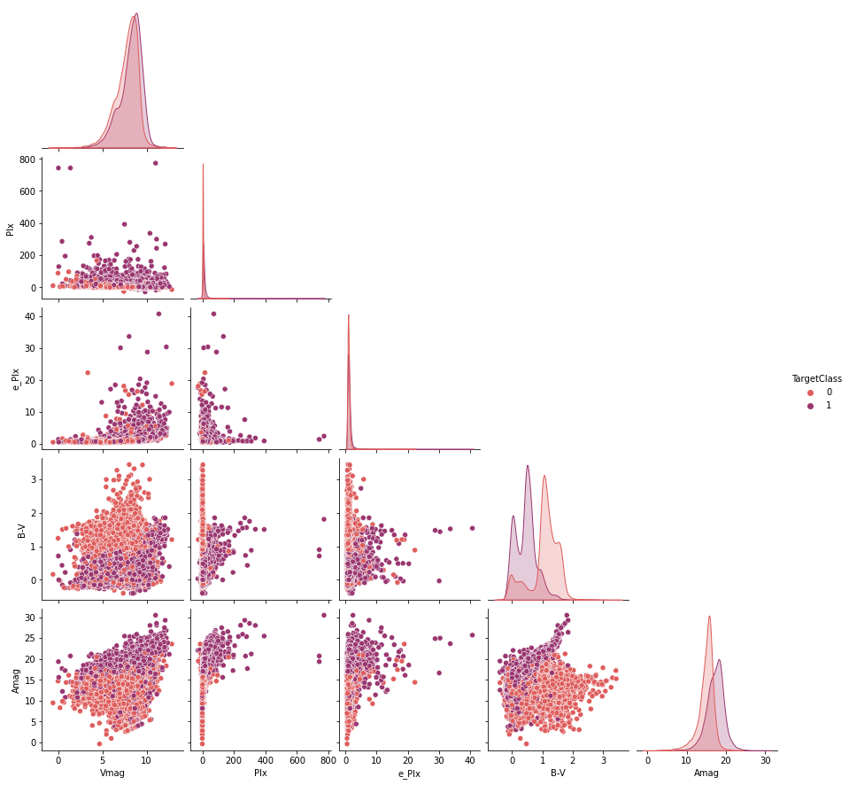
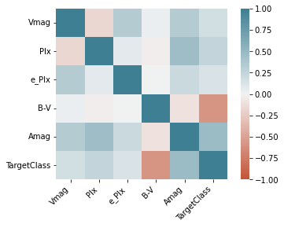
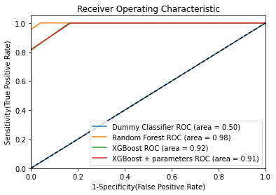

# Classifying stars

Processed and balanced data obtained from [Kaggle](https://www.kaggle.com/vinesmsuic/star-categorization-giants-and-dwarfs)

I will used this data set to test out the XGBoost classifier. Information on the dataset is as follows:

        Stellar Classification uses the spectral data of stars to categorize them 
        into different categories.
        
        The modern stellar classification system is known as the Morgan–Keenan (MK)
        classification system. It uses the old HR classification system to categorize
        stars with their chromaticity and uses Roman numerals to categorize the star’s
        size.
        
        In this Dataset, we will be using Absolute Magnitude and B-V Color Index to
        Identify Giants and Dwarfs (`TargetClass`).

Classifying stars based on their `TargetClass` as being either:
- Star is a Dwarf (0)
- Star is a Giant (1)

Note: This is a good dataset for learning about XGBoost, but it is not a good problem to solve with XGBoost as the number of features are relatively small and the problem is a simple binary classification problem.


```python
#load libraries
import pandas as pd
import numpy as np

from matplotlib import pyplot as plt
import seaborn as sns

from xgboost import XGBClassifier

from sklearn.model_selection import train_test_split, cross_val_score
from sklearn.pipeline import Pipeline
from sklearn.preprocessing import OneHotEncoder
from sklearn.compose import ColumnTransformer
from sklearn.ensemble import RandomForestClassifier
from sklearn.dummy import DummyClassifier
from sklearn.metrics import mean_absolute_error
from sklearn.metrics import confusion_matrix
from sklearn.metrics import roc_auc_score
from sklearn.metrics import roc_curve

```


```python
#read in zip file
star_df = pd.read_csv('data/Star39552_balanced.csv.zip')
```

# Quick EDA


```python
star_df.describe(include='all')
```


<div>
<style scoped>
    .dataframe tbody tr th:only-of-type {
        vertical-align: middle;
    }

    .dataframe tbody tr th {
        vertical-align: top;
    }

    .dataframe thead th {
        text-align: right;
    }
</style>
<table border="1" class="dataframe">
  <thead>
    <tr style="text-align: right;">
      <th></th>
      <th>Vmag</th>
      <th>Plx</th>
      <th>e_Plx</th>
      <th>B-V</th>
      <th>SpType</th>
      <th>Amag</th>
      <th>TargetClass</th>
    </tr>
  </thead>
  <tbody>
    <tr>
      <th>count</th>
      <td>39552.000000</td>
      <td>39552.000000</td>
      <td>39552.000000</td>
      <td>39552.000000</td>
      <td>39552</td>
      <td>39552.000000</td>
      <td>39552.000000</td>
    </tr>
    <tr>
      <th>unique</th>
      <td>NaN</td>
      <td>NaN</td>
      <td>NaN</td>
      <td>NaN</td>
      <td>2576</td>
      <td>NaN</td>
      <td>NaN</td>
    </tr>
    <tr>
      <th>top</th>
      <td>NaN</td>
      <td>NaN</td>
      <td>NaN</td>
      <td>NaN</td>
      <td>K0III</td>
      <td>NaN</td>
      <td>NaN</td>
    </tr>
    <tr>
      <th>freq</th>
      <td>NaN</td>
      <td>NaN</td>
      <td>NaN</td>
      <td>NaN</td>
      <td>2841</td>
      <td>NaN</td>
      <td>NaN</td>
    </tr>
    <tr>
      <th>mean</th>
      <td>7.921309</td>
      <td>7.117378</td>
      <td>1.109705</td>
      <td>0.744336</td>
      <td>NaN</td>
      <td>16.050687</td>
      <td>0.500000</td>
    </tr>
    <tr>
      <th>std</th>
      <td>1.308857</td>
      <td>12.446291</td>
      <td>0.788133</td>
      <td>0.513987</td>
      <td>NaN</td>
      <td>2.443937</td>
      <td>0.500006</td>
    </tr>
    <tr>
      <th>min</th>
      <td>-0.620000</td>
      <td>-27.840000</td>
      <td>0.420000</td>
      <td>-0.400000</td>
      <td>NaN</td>
      <td>-0.350000</td>
      <td>0.000000</td>
    </tr>
    <tr>
      <th>25%</th>
      <td>7.210000</td>
      <td>2.430000</td>
      <td>0.800000</td>
      <td>0.358000</td>
      <td>NaN</td>
      <td>14.756514</td>
      <td>0.000000</td>
    </tr>
    <tr>
      <th>50%</th>
      <td>8.160000</td>
      <td>4.440000</td>
      <td>0.990000</td>
      <td>0.703000</td>
      <td>NaN</td>
      <td>16.020827</td>
      <td>0.500000</td>
    </tr>
    <tr>
      <th>75%</th>
      <td>8.830000</td>
      <td>8.232500</td>
      <td>1.230000</td>
      <td>1.129000</td>
      <td>NaN</td>
      <td>17.590542</td>
      <td>1.000000</td>
    </tr>
    <tr>
      <th>max</th>
      <td>12.850000</td>
      <td>772.330000</td>
      <td>40.630000</td>
      <td>3.440000</td>
      <td>NaN</td>
      <td>30.449015</td>
      <td>1.000000</td>
    </tr>
  </tbody>
</table>
</div>


All numeric apart from `SPtype` and `TargetClass` (which is numeric but only 0 or 1)


```python
#check missing
star_df.isnull().sum()
```


    Vmag           0
    Plx            0
    e_Plx          0
    B-V            0
    SpType         0
    Amag           0
    TargetClass    0
    dtype: int64


```python
# pairs plot to have a look at the data
sns.pairplot(star_df,
hue = 'TargetClass',
palette = 'flare',
corner = True)
```


    <seaborn.axisgrid.PairGrid at 0x7ffb59557910>


    

    


`Pix` and `e_Pix` look like they could do with being log transformed. For this initial run I am not going to do this.

B-V is binomial for `TargetClass`= 1 (giants)


```python
corr = star_df.corr()
corr_plot = sns.heatmap(
    corr, 
    vmin=-1, vmax=1, center=0,
    cmap=sns.diverging_palette(20, 220, n=200),
    square=True
)
corr_plot.set_xticklabels(
    corr_plot.get_xticklabels(),
    rotation=45,
    horizontalalignment='right'
);
```


    

    


`B-V` and `TargetClass` are strongly negatively correlated. `Amag` and `TargetClass` are moderately positively correlated. Other correlations appear fairly weak.

# Create train test split


```python
X = star_df.drop('TargetClass', axis=1)
y = star_df.TargetClass
```


```python
# list of predictor names for later labelling
X_names = list(X)
```


```python
X_train, X_test, y_train, y_test = train_test_split(X, y, test_size=0.2, random_state=42)
```

Now prepare categorical columns for One-hot Encoding.


```python
# sort categorical columns from numeric
cat = (X_train.dtypes == 'object')
cat_cols = list(cat[cat].index)

```

    ['SpType']


# Start building the pipeline


```python
# create one-hot encoder transformer
cat_transformer = Pipeline(steps=[
    ('onehot', OneHotEncoder(handle_unknown='ignore', sparse='False'))
])

# create preprocessor
preprocessor = ColumnTransformer(
    transformers=[
        ('cat', cat_transformer, cat_cols)
    ])
```

## First model - Dummy classifier


```python
# define initial dummy model
dummy_model = DummyClassifier(random_state=42)
```


```python
dummy_pipe = Pipeline(steps=[('preprocessor', preprocessor),
                                    ('model', dummy_model)])

```


```python
# run the dummy pipeline
dummy_pipe.fit(X_train, y_train)
```


    Pipeline(steps=[('preprocessor',
                     ColumnTransformer(transformers=[('cat',
                                                      Pipeline(steps=[('onehot',
                                                                       OneHotEncoder(handle_unknown='ignore',
                                                                                     sparse='False'))]),
                                                      ['SpType'])])),
                    ('model', DummyClassifier(random_state=42))])


```python
# def model metrics for use in all models tried
# assumes train test split defined with X and y

def model_metrics(input_pipe):
    print("Training Accuracy", (input_pipe.score(X_train, y_train)) * 100)
    print("Test Accuracy", (input_pipe.score(X_test, y_test)) * 100)

    y_pred_test = input_pipe.predict(X_test)
    y_pred_train = input_pipe.predict(X_train)
    print("MAE train", mean_absolute_error(y_train.astype('int'),
                                        y_pred_train.astype('int')))
    print("MAE test", mean_absolute_error(y_test.astype('int'),
                                         y_pred_test.astype('int')))
    print("AUC train", roc_auc_score(y_train, y_pred_train))
    print("AUC test", roc_auc_score(y_test, y_pred_test))
```


```python
model_metrics(dummy_pipe)
```

    Training Accuracy 50.26705856325654
    Test Accuracy 48.93186702060422
    MAE train 0.49732941436743466
    MAE test 0.5106813297939578
    AUC train 0.5
    AUC test 0.5


As expected, the dummy classifier is no better than 50/50 guess!

## Second model - Random Forest

Note - This model is for comparision with XGBoost. 
If I were training a random methodically, could use cross-validation (i.e. `GridSearchCV`) to maximise AUC and tune the hyper-parameters to determine the optimal value from the search grid.

Three parameters are important to tweak to avoid overfitting a random forest:

* `n_estimators` - more trees reduces overfitting
* `max_depth` - the deeper the tree the more the risk of overfitting
* `min_samples_leaves` - the smaller the number of training exmples in the leave the greater the risk of overfitting


```python
#use default settings for random forest
rf_model = RandomForestClassifier(random_state=42)

rf_pipe = Pipeline(steps=[('preprocessor', preprocessor),
                                    ('model', rf_model)])

# run the rf pipeline
rf_pipe.fit(X_train, y_train)
```


    Pipeline(steps=[('preprocessor',
                     ColumnTransformer(transformers=[('cat',
                                                      Pipeline(steps=[('onehot',
                                                                       OneHotEncoder(handle_unknown='ignore',
                                                                                     sparse='False'))]),
                                                      ['SpType'])])),
                    ('model', RandomForestClassifier(random_state=42))])


```python
# get model metrics
model_metrics(rf_pipe)
```

    Training Accuracy 100.0
    Test Accuracy 97.74996839843256
    MAE train 0.0
    MAE test 0.022500316015674378
    AUC train 1.0
    AUC test 0.977970297029703


Oh wow. This data is modelled extremely well with the random forest model. As I thought initially, this is not a good dataset for XGBoost. But it will give me good practice in setting up the pipelines to run the models.

## Third model - XGBoost

Extreme Gradient Boosting (XGBoost) uses gradient boosting framework.
Boosting uses weak learners (models), makes conclusions about feature importance and parameters and uses these to build better models by trying to reduce the error of the previous model.

For XGBoost: 
 - The weak learner is a tree ensemble.
 - The model has an inbuilt cross-validation function.
 - It can handle missing values.

For this run I will use the scikit-learn API of XGBoost.

  - note if use xgb version of XGBoost the data needs to be in DMatrices:
```python
# example of native xgb
import xgboost as xgb
dtrain = xgb.DMatrix(X_train, label=y_train) #etc.
```

```python
#use default settings for XGBoost, set eval_metric
xgb_model = XGBClassifier(use_label_encoder=False, eval_metric = 'mlogloss')

xgb_pipe = Pipeline(steps=[('preprocessor', preprocessor),
                                    ('model', xgb_model)])

# run the xgb pipeline
xgb_pipe.fit(X_train, y_train)
```


    Pipeline(steps=[('preprocessor',
                     ColumnTransformer(transformers=[('cat',
                                                      Pipeline(steps=[('onehot',
                                                                       OneHotEncoder(handle_unknown='ignore',
                                                                                     sparse='False'))]),
                                                      ['SpType'])])),
                    ('model',
                     XGBClassifier(base_score=0.5, booster='gbtree',
                                   colsample_bylevel=1, colsample_bynode=1,
                                   colsample_bytree=1, eval_metric='mlogloss',
                                   gamma=0, gpu_id=-1, importance_type='gain',
                                   interaction_constraints='',
                                   learning_rate=0.300000012, max_delta_step=0,
                                   max_depth=6, min_child_weight=1, missing=nan,
                                   monotone_constraints='()', n_estimators=100,
                                   n_jobs=8, num_parallel_tree=1, random_state=0,
                                   reg_alpha=0, reg_lambda=1, scale_pos_weight=1,
                                   subsample=1, tree_method='exact',
                                   use_label_encoder=False, validate_parameters=1,
                                   verbosity=None))])


```python
# get model metrics
model_metrics(xgb_pipe)
```

    Training Accuracy 91.75436933093138
    Test Accuracy 92.01112375173808
    MAE train 0.08245630669068614
    MAE test 0.07988876248261914
    AUC train 0.9179817667400189
    AUC test 0.9183673469387755


XGBoost straight out of the box is performing reasonably well, but it is not as good as the random forest. Try tuning the hyperparameters to get a better model.

Hyperparameters we can tune include:

* `n_estimators` - same as the random forest this is the number of models in the ensemble
* `learning_rate` - shrinks the feature weights on each step to prevent overfitting. Default is 0.1. Lowering this reduces how much the model retrains and can help prevent overfitting, however a lower learning rate also needs more boosting rounds and increases training time
* `objective` -  defines the loss function to be minimised
* `early_stopping_rounds` - not used in the parameter tuning below. This helps prevent overfitting by assessing the performance of the model at each round and stopping the model if performance hasn't improved by the number of rounds set by this parameter

To have a look I am going to change some of the hyperparameters discussed above, but a more robust way to tune hyperparameters is with the `cv` function from XGBoost. This lets you run cross-validation on the training dataset and returns a mean MAE score.<br /><br />
To do this the data would need to be in XGBoost format and we would need to be running the `xgb` version of `xgboost`.


```python
# declare parameters to be tuned
param = {
    'objective': 'binary:logistic',
    'max_depth': 4,
    'alpha': 10,
    'learning_rate': 0.15,
    'n_estimators': 1000,
    'use_label_encoder': False,
    'eval_metric': 'mlogloss'
}
```


```python
#use parameters for XGBoost, set eval_metric
xgb_param_model = XGBClassifier(**param)

xgb_param_pipe = Pipeline(steps=[('preprocessor', preprocessor),
                                    ('model', xgb_param_model)])

# run the pipeline
xgb_param_pipe.fit(X_train, y_train)
```


    Pipeline(steps=[('preprocessor',
                     ColumnTransformer(transformers=[('cat',
                                                      Pipeline(steps=[('onehot',
                                                                       OneHotEncoder(handle_unknown='ignore',
                                                                                     sparse='False'))]),
                                                      ['SpType'])])),
                    ('model',
                     XGBClassifier(alpha=10, base_score=0.5, booster='gbtree',
                                   colsample_bylevel=1, colsample_bynode=1,
                                   colsample_bytree=1, eval_metric='mlogloss',
                                   gamma=0, gpu_id=-1, importance_type='gain',
                                   interaction_constraints='', learning_rate=0.15,
                                   max_delta_step=0, max_depth=4,
                                   min_child_weight=1, missing=nan,
                                   monotone_constraints='()', n_estimators=1000,
                                   n_jobs=8, num_parallel_tree=1, random_state=0,
                                   reg_alpha=10, reg_lambda=1, scale_pos_weight=1,
                                   subsample=1, tree_method='exact',
                                   use_label_encoder=False, validate_parameters=1,
                                   verbosity=None))])


```python
# get model metrics
model_metrics(xgb_param_pipe)
```

    Training Accuracy 91.06538984229323
    Test Accuracy 91.22740487928202
    MAE train 0.08934610157706772
    MAE test 0.08772595120717988
    AUC train 0.9111285759195222
    AUC test 0.9103590803409971


Adding the parameters has made the model worse! Another sign that the XGBoost model really isn't the model for this data.

## ROC comparison of models

To compare the models run on the data so far, I will finish this off with a ROC comparison plot of all models.


```python
plt.figure(0).clf()

# add pipes for ROC
pipes = [
    {
        'label':'Dummy Classifier', 
        'pipe': dummy_pipe, 
    }, 
    {
        'label':'Random Forest', 
        'pipe': rf_pipe,
    },
    {
        'label':'XGBoost', 
        'pipe': xgb_pipe,
    },
    {
        'label':'XGBoost + parameters', 
        'pipe': xgb_param_pipe,
    }
]

# iterate through pipes and plot
for p in pipes:
    pipe = p['pipe']
    y_pred=pipe.predict(X_test)
    fpr, tpr, thresholds = roc_curve(y_test, pipe.predict_proba(X_test)[:,1])
    auc = roc_auc_score(y_test, y_pred)
    plt.plot(fpr, tpr, label='%s ROC (area = %0.2f)' % (p['label'], auc))
    
plt.plot([0, 1], [0, 1],'k--')
plt.xlim([0.0, 1.0])
plt.ylim([0.0, 1.05])
plt.xlabel('1-Specificity(False Positive Rate)')
plt.ylabel('Sensitivity(True Positive Rate)')
plt.title('Receiver Operating Characteristic')
plt.legend(loc="lower right")
plt.show() 
```


    

    


# Summary

* Initial run of XGBoost
* Addition of parameter feature tweak to XGBoost
* Random forest outperformed XGBoost on this data
* Highlights the importance of selecting data-appropriate models

# Future runs

* Include CV (cross-validation) for hyperparameter tuning
* Remember that if you are running predictions - once you have the best model, run it again on all the data
